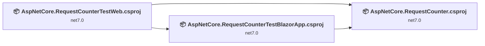
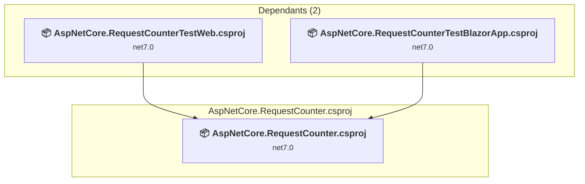
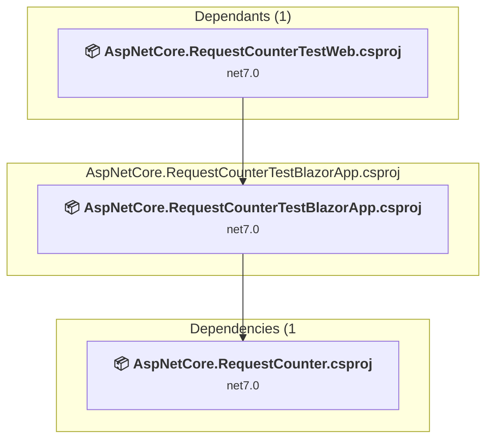
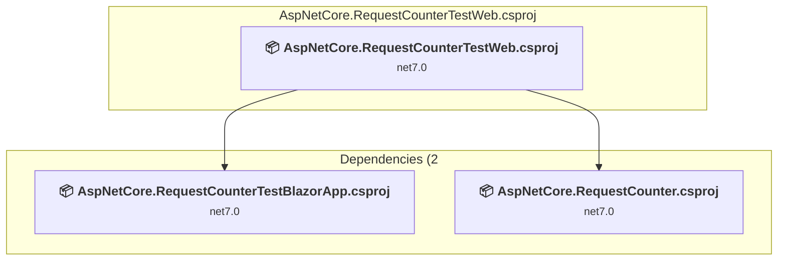

# Projects and dependencies analysis

This document provides a comprehensive overview of the projects and their dependencies in the context of upgrading to .NETCoreApp,Version=v10.0.

## Table of Contents

- [Executive Summary](#executive-Summary)
  - [Highlevel Metrics](#highlevel-metrics)
  - [Projects Compatibility](#projects-compatibility)
  - [Package Compatibility](#package-compatibility)
  - [API Compatibility](#api-compatibility)
- [Aggregate NuGet packages details](#aggregate-nuget-packages-details)
- [Top API Migration Challenges](#top-api-migration-challenges)
  - [Technologies and Features](#technologies-and-features)
  - [Most Frequent API Issues](#most-frequent-api-issues)
- [Projects Relationship Graph](#projects-relationship-graph)
- [Project Details](#project-details)

  - [AspNetCore.RequestCounter\AspNetCore.RequestCounter.csproj](#aspnetcorerequestcounteraspnetcorerequestcountercsproj)
  - [AspNetCore.RequestCounterTestBlazorApp\AspNetCore.RequestCounterTestBlazorApp.csproj](#aspnetcorerequestcountertestblazorappaspnetcorerequestcountertestblazorappcsproj)
  - [AspNetCore.RequestCounterTestWeb\AspNetCore.RequestCounterTestWeb.csproj](#aspnetcorerequestcountertestwebaspnetcorerequestcountertestwebcsproj)

## Executive Summary

### Highlevel Metrics

| Metric | Count | Status |
| :--- | :---: | :--- |
| Total Projects | 3 | All require upgrade |
| Total NuGet Packages | 1 | All packages need upgrade |
| Total Code Files | 23 |  |
| Total Code Files with Incidents | 5 |  |
| Total Lines of Code | 600 |  |
| Total Number of Issues | 6 |  |
| Estimated LOC to modify | 2+ | at least 0,3% of codebase |

### Projects Compatibility

| Project | Target Framework | Difficulty | Package Issues | API Issues | Est. LOC Impact | Description |
| :--- | :---: | :---: | :---: | :---: | :---: | :--- |
| [AspNetCore.RequestCounter\AspNetCore.RequestCounter.csproj](#aspnetcorerequestcounteraspnetcorerequestcountercsproj) | net7.0 | 🟢 Low | 1 | 0 |  | ClassLibrary, Sdk Style = True |
| [AspNetCore.RequestCounterTestBlazorApp\AspNetCore.RequestCounterTestBlazorApp.csproj](#aspnetcorerequestcountertestblazorappaspnetcorerequestcountertestblazorappcsproj) | net7.0 | 🟢 Low | 0 | 1 | 1+ | AspNetCore, Sdk Style = True |
| [AspNetCore.RequestCounterTestWeb\AspNetCore.RequestCounterTestWeb.csproj](#aspnetcorerequestcountertestwebaspnetcorerequestcountertestwebcsproj) | net7.0 | 🟢 Low | 0 | 1 | 1+ | AspNetCore, Sdk Style = True |

### Package Compatibility

| Status | Count | Percentage |
| :--- | :---: | :---: |
| ✅ Compatible | 0 | 0,0% |
| ⚠️ Incompatible | 1 | 100,0% |
| 🔄 Upgrade Recommended | 0 | 0,0% |
| ***Total NuGet Packages*** | ***1*** | ***100%*** |

### API Compatibility

| Category | Count | Impact |
| :--- | :---: | :--- |
| 🔴 Binary Incompatible | 0 | High - Require code changes |
| 🟡 Source Incompatible | 0 | Medium - Needs re-compilation and potential conflicting API error fixing |
| 🔵 Behavioral change | 2 | Low - Behavioral changes that may require testing at runtime |
| ✅ Compatible | 2742 |  |
| ***Total APIs Analyzed*** | ***2744*** |  |

## Aggregate NuGet packages details

| Package | Current Version | Suggested Version | Projects | Description |
| :--- | :---: | :---: | :--- | :--- |
| Microsoft.AspNetCore.Http.Abstractions | 2.2.0 |  | [AspNetCore.RequestCounter.csproj](#aspnetcorerequestcounteraspnetcorerequestcountercsproj) | ⚠️Das NuGet-Paket ist veraltet |

## Top API Migration Challenges

### Technologies and Features

| Technology | Issues | Percentage | Migration Path |
| :--- | :---: | :---: | :--- |

### Most Frequent API Issues

| API | Count | Percentage | Category |
| :--- | :---: | :---: | :--- |
| M:Microsoft.AspNetCore.Builder.ExceptionHandlerExtensions.UseExceptionHandler(Microsoft.AspNetCore.Builder.IApplicationBuilder,System.String) | 2 | 100,0% | Behavioral Change |

## Projects Relationship Graph

Legend:
📦 SDK-style project
⚙️ Classic project

## Project Details

### AspNetCore.RequestCounter\AspNetCore.RequestCounter.csproj

#### Project Info

- **Current Target Framework:** net7.0
- **Proposed Target Framework:** net10.0
- **SDK-style**: True
- **Project Kind:** ClassLibrary
- **Dependencies**: 0
- **Dependants**: 2
- **Number of Files**: 6
- **Number of Files with Incidents**: 1
- **Lines of Code**: 187
- **Estimated LOC to modify**: 0+ (at least 0,0% of the project)

#### Dependency Graph

Legend:
📦 SDK-style project
⚙️ Classic project

### API Compatibility

| Category | Count | Impact |
| :--- | :---: | :--- |
| 🔴 Binary Incompatible | 0 | High - Require code changes |
| 🟡 Source Incompatible | 0 | Medium - Needs re-compilation and potential conflicting API error fixing |
| 🔵 Behavioral change | 0 | Low - Behavioral changes that may require testing at runtime |
| ✅ Compatible | 210 |  |
| ***Total APIs Analyzed*** | ***210*** |  |

### AspNetCore.RequestCounterTestBlazorApp\AspNetCore.RequestCounterTestBlazorApp.csproj

#### Project Info

- **Current Target Framework:** net7.0
- **Proposed Target Framework:** net10.0
- **SDK-style**: True
- **Project Kind:** AspNetCore
- **Dependencies**: 1
- **Dependants**: 1
- **Number of Files**: 29
- **Number of Files with Incidents**: 2
- **Lines of Code**: 169
- **Estimated LOC to modify**: 1+ (at least 0,6% of the project)

#### Dependency Graph

Legend:
📦 SDK-style project
⚙️ Classic project

### API Compatibility

| Category | Count | Impact |
| :--- | :---: | :--- |
| 🔴 Binary Incompatible | 0 | High - Require code changes |
| 🟡 Source Incompatible | 0 | Medium - Needs re-compilation and potential conflicting API error fixing |
| 🔵 Behavioral change | 1 | Low - Behavioral changes that may require testing at runtime |
| ✅ Compatible | 1364 |  |
| ***Total APIs Analyzed*** | ***1365*** |  |

### AspNetCore.RequestCounterTestWeb\AspNetCore.RequestCounterTestWeb.csproj

#### Project Info

- **Current Target Framework:** net7.0
- **Proposed Target Framework:** net10.0
- **SDK-style**: True
- **Project Kind:** AspNetCore
- **Dependencies**: 2
- **Dependants**: 0
- **Number of Files**: 16
- **Number of Files with Incidents**: 2
- **Lines of Code**: 244
- **Estimated LOC to modify**: 1+ (at least 0,4% of the project)

#### Dependency Graph

Legend:
📦 SDK-style project
⚙️ Classic project

### API Compatibility

| Category | Count | Impact |
| :--- | :---: | :--- |
| 🔴 Binary Incompatible | 0 | High - Require code changes |
| 🟡 Source Incompatible | 0 | Medium - Needs re-compilation and potential conflicting API error fixing |
| 🔵 Behavioral change | 1 | Low - Behavioral changes that may require testing at runtime |
| ✅ Compatible | 1168 |  |
| ***Total APIs Analyzed*** | ***1169*** |  |

